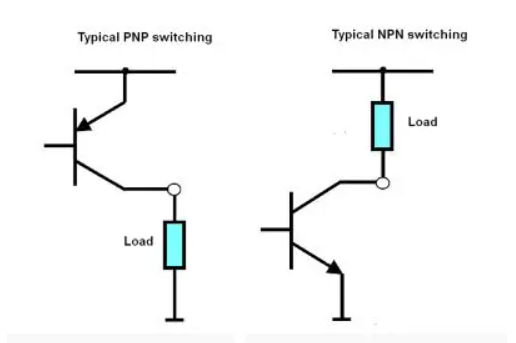

# Circuit With Transistors

- [Circuit With Transistors](#circuit-with-transistors)
  - [Basics](#basics)
  - [Sinks and Sources](#sinks-and-sources)
  - [Prelimiary Notes](#prelimiary-notes)
  - [Types of Transistors](#types-of-transistors)
  - [Usages for Transistors](#usages-for-transistors)
    - [Links](#links)

#### Basics
- States
  - **Cut-off** (no current): Emitter diode and collector diode are *off*.
  - **Active** (amplifying): Emitter diode is *on* and the collector diode is *off*.
  - **Saturated** ("short" just wire): Emitter diode and collector diode are *on*.

 

#### Sinks and Sources
- BJTs
  - For sources, use **PNP**, pull-up
  - For sinks, user **NPN**, pull-down
  - 

 

#### Equations
|type|equation|
|---|---|
|pnp| $I_C=I_E-I_B$ $I_C=\beta I_B$ $I_B=\cfrac{I_C}{\beta}$ &nbsp;|

 

#### Prelimiary Notes
- "The problem is that you're trying to use NPN transistors for high-side switching, without having a drive voltage higher than $V_{cc}$. So your high side drive is incapable of being saturated"

 

#### Types of Transistors
- N-Channel MOSFETS
- P-Channel MOSFETS
- BJT Transistors
- JFET Transistors

- s9014 - NPN

 

#### Usages for Transistors
- logic circuits
- tie high/low
- amplification
- control current flow

 

##### Links
- (https://www.testandmeasurementtips.com/when-to-use-npn-and-pnp-transistors-and-fets-faq/)[https://www.testandmeasurementtips.com/when-to-use-npn-and-pnp-transistors-and-fets-faq/]
- (https://www.electronics-tutorials.ws/transistor/tran_3.html)[https://www.electronics-tutorials.ws/transistor/tran_3.html]